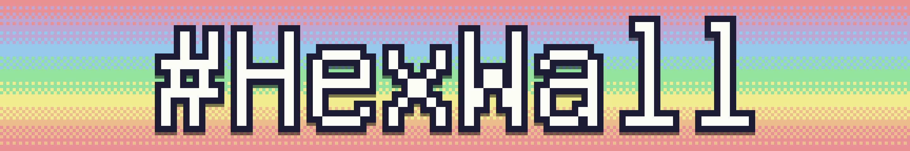

## Installation
Download setup file from [releases](https://github.com/Soryyyn/HexWall/releases).

## Usage
After installation it should show up in the tray. Everything else should be self explanatory.